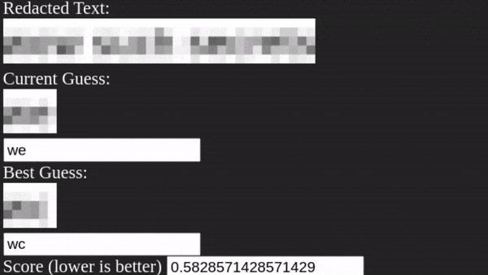

# Unredacter

Shows you why you should never ever ever use pixelation as a redaction technique. For a more complete writeup of how this works, [check out my blog post here](https://bishopfox.com/blog/unredacter-tool-never-pixelation).

## How to Try it Out

Install the dependencies:

`npm install`

Then start with

`npm start`

That's it.

## How to Crack Your Own Pixelated Image

This is a bit manual and not at all streamlined. I think you'll see why. If someone feels like taking a shot at making this process more in-app, I'm all ears. What do I look like, an Electron developer? But yea here it is:

1) Crop your image down to just the pixelated area. No borders, no other text. Replace `secret.png` with that. I recommend doing it in GiMP.

2) Make note of the block size (it's just the size of each pixelated block). Replace `blockSize` in the code with that.

3) Get the CSS just right. This is the hardest and most time-consuming part. Try entering it into `test.html` and view it in Chrome. Tweak it until you can replicate some sample text as exactly as possible. Pay particular attention to the word and letter spacing. If it skews, then it'll all mess up. Also the font-weight, or else things will end up too light or dark. I can't emphasize enough how critical this step is, as the whole thing really depends on being able to correctly replicate the redacted characters.

4) Determine what character set you want to try. It's at the top of `preload.ts`.

5) Press the go button and see if it works!
